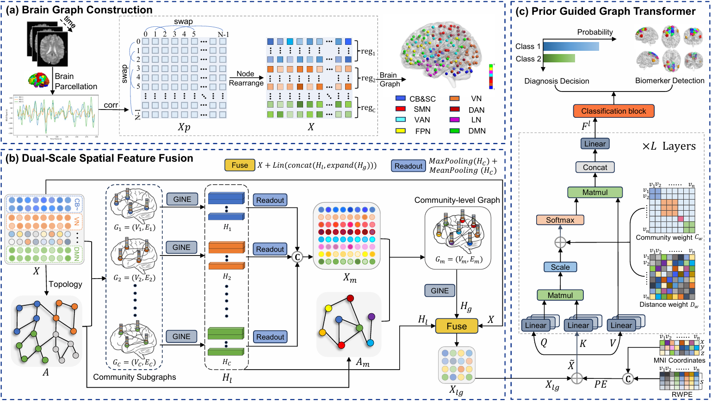

# Community-Aware Graph Transformer (CAGT)

This is the official PyTorch implementation for the paper **["Community-Aware Graph Transformer for Brain Disorder Identification"](https://www.ijcai.org/proceedings/2025/0467.pdf)**.

This project introduces a novel Community-Aware Graph Transformer (CAGT), a framework that integrates sub-network community information and the topological structure of brain graphs into the Transformer architecture to enhance brain disorder identification.

## Introduction

Abnormal brain functional networks are effective biomarkers for diagnosing brain diseases. While most existing methods focus on whole-brain connectivity patterns, they often overlook the multi-level collaboration that is fundamental to efficient brain function. Our proposed method, CAGT, enhances information exchange within and between functional communities by using dual-scale feature fusion to capture interactive information across various scales. Additionally, it leverages prior knowledge to design brain region positional encoding and to guide the self-attention mechanism, thereby improving the Transformer's spatial awareness and aligning it more closely with the brain's natural information transfer processes.

## Framework


The overall framework of CAGT is illustrated below, consisting of three primary modules:

1.  **Brain Graph Construction**: Rearranges the rows and columns of the functional connectivity matrix and sparsifies it to construct a whole-brain topology and multiple community subgraphs.
2.  **Dual-Scale Spatial Feature Fusion**: Gathers information at both the node and community scales to obtain a more comprehensive representation of brain regions.
3.  **Prior Guided Graph Transformer**: Implements brain disorder identification using a specially designed positional encoding and attention mechanism that aligns with brain function.


## Getting Started


### Datasets

This study uses three public datasets:
1.  **[ABIDE I](http://fcon_1000.projects.nitrc.org/indi/abide/)**: For Autism Spectrum Disorder (ASD) research.
2.  **[REST-MDD](http://rfmri.org/REST-meta-MDD)**: For Major Depressive Disorder (MDD) research.
3.  **[TaoWu and Neurocon](https://fcon_1000.projects.nitrc.org/indi/retro/parkinsons.html)**: For Parkinson's Disease (PD) research.
  
For each subject, the brain is parcellated into 200 regions of interest (ROIs) using the CC200 atlas and further clustered into eight sub-networks.

### Training

Use the following command to train the model. You can adjust the hyperparameters as needed.

```bash
python train.py --root_dir ./dataset/ABIDE_I --epochs 70 --batch_size 64 --dropout 0.2
```

### Dependencies

  - python=3.9
  - cudatoolkit=12.1
  - torch=2.2.1
  - torchvision=0.17.1
  - torchaudio=2.2.1
  - torch-cluster=1.6.3
  - torch-geometric=2.5.3
  - torch-scatter=2.1.2
  - torch-sparse=0.6.18
  - torch-spline-conv=1.2.2
  - scikit-learn=1.5.0
  - numpy=1.22.4


## Directory Structure

```
.
├── datasets
│   ├── ABIDEDataset.py
│   ├── read_data.py
│   └── ...
├── model
│   ├── models.py
│   ├── layers.py
│   ├── gnn_layers.py
│   └── ...
├── train.py
└── README.md
```

  - **datasets/**: Contains scripts for data loading and preprocessing.
  - **model/**: Contains the implementation of the CAGT model, including GNN layers, Transformer layers, and position encoding.
  - **train.py**: The main script to start model training and evaluation.


## How to Cite

If you use this work in your research, please cite our paper:

```bibtex
@inproceedings{ijcai2025p467,
  title     = {Community-Aware Graph Transformer for Brain Disorder Identification},
  author    = {Pei, Shengbing and Ma, Jiajun and Lv, Zhao and Zhang, Chao and Guan, Jihong},
  booktitle = {Proceedings of the Thirty-Fourth International Joint Conference on
               Artificial Intelligence, {IJCAI-25}},
  publisher = {International Joint Conferences on Artificial Intelligence Organization},
  editor    = {James Kwok},
  pages     = {4191--4199},
  year      = {2025},
  month     = {8},
  note      = {Main Track},
  doi       = {10.24963/ijcai.2025/467},
  url       = {https://doi.org/10.24963/ijcai.2025/467},
}
```


